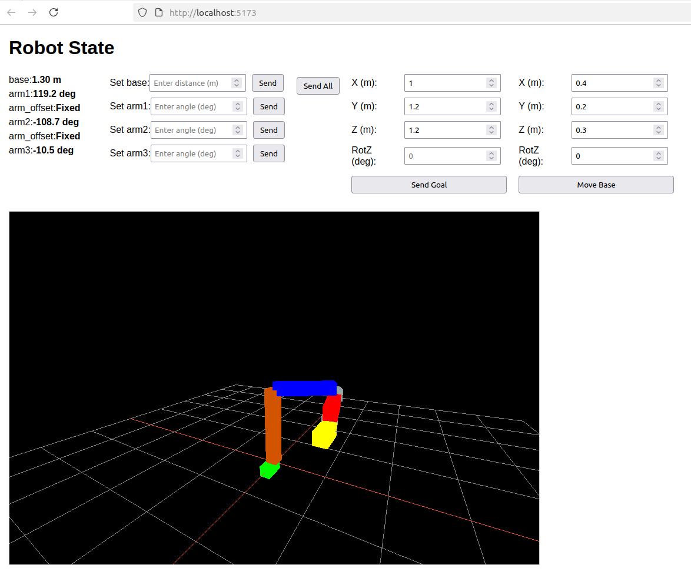

# robot_vizualisation

This repository contains my implementation of the take home assignment for the software controls position.

## Requirements
- Node.js and npm. I used node.js v20.19.1 and npm v10.8.2.
- Vite, TypeScript, and `twgl.js` (installed via `npm install`).
- C++ packages: nlohmann_json (3.10.5-2).
- Only tested in Ubuntu 22.04.


## How to run
Clone the repository:
```bash
git clone https://github.com/robruigrok/robot_visualization.git
```
Initialize the websocketpp submodule used in the backend:
```bash
git submodule update --init --recursive 
```

Build the backend:
```bash
cd backend
mkdir build && cd build
cmake ..
make
```
Run the backend executable in the /build folder. It uses websocket 3000.
```bash
./backend
```
Install frontend dependencies:
```bash
cd frontend
npm install
```
Run the development server:
```bash
npm run dev
```
Open `http://localhost:5173` in a browser, it should show you the GUI:




## Design

Here I will list the different classes and how they are used:

### RoboticArm
The RoboticArm class is the main class which defines the configuration and shape of the robotic arm. It also serves as the interface for the WebSocketServer, where the motion setpoints can be set.

The robotic arm can be configured in the constructor in the ```robot_arm.cpp```. Here you can stack different links which together make up the robot. One needs to specify a link name, translation, rotation, type of link (static of movable in certain direction), range limits, and velocity and acceleration limits. Here you see how the current robotic arm is configured:

```
// Entities in links: translation x, y z, rotation x, y, z, type, range_min, range_max, max_speed, max_acceleration    
links = {
    RobotLink("move_base_x", 0.0f, 0.0f, 0.0f, 0.0f, 0.0f, 0.0f,
                RobotLink::LinkType::Move_Base, 0.0, 0.0f, 0.0f, 0.0f),     
    // Base: 1.5m tall, 0.3m x 0.3m
    RobotLink("base", 0.0f, 0.0f, 1.5f, 0.0f, 0.0f, 0.0f,
                RobotLink::LinkType::Z, 1.0f, 2.0f, 0.2f, 0.2f),
    // Arm1: 1m long (X), rotates around Z at base top (0, 0, 1.5)
    RobotLink("arm1", 1.0f, 0.0f, 0.0f, 0.0f, 0.0f, 0.0f,
                RobotLink::LinkType::ROT_Z, -3.1416f, 3.1416f, 0.2f, 0.2f),
    // Arm offset: 0.2m down (Z), static
    RobotLink("arm_offset", 0.0f, 0.0f, -0.2f, 0.0f, 0.0f, 0.0f,
                RobotLink::LinkType::STATIC, 0.0f, 0.0f, 0.0f, 0.0f),
    // Arm2: 0.7m long (X), rotates around Z at arm1 end
    RobotLink("arm2", 0.7f, 0.0f, 0.0f, 0.0f, 0.0f, 0.0f,
                RobotLink::LinkType::ROT_Z, -3.1416f, 3.1416f, 0.2f, 0.2f),

etc.
```
Aside from configuring the robot, the RoboticArm class contains the methods for computing inverse kinematics (which sets the motion setpoints for individual links) and moves the base.

> **_NOTE:_**  When using inverse kinematics, the code assumes a robot configuration as defined in the assignement: vertically moving base with 3 rotating arms. For visualizing and controlling individual joints, the robot can have any configuratoin you like.

### RobotLink
The RobotLink object handles the motion of each individual link. It keeps track of the links current position and velocity, and can be called for setting requested positions and velocities. The RobotLink object also contains the controllers for controlling position and velocity of the current link.

### WebSocketServer
This class takes care of communication with the frontend. Based on incoming information it sets motion setpoints. It sends the current state of the robot to the frontend by parsing the vector of links and extracting the position and rotation.


## Control structure

### Controlling individual link
When controlling individual links:
- Set a reference position for each link.
- Then, the ```computePositionControl``` method is called, which in turn returns a reference velocity. 
- This reference velocity, taking into account the velocity limit, is then provided to the ```computeVelocityControl``` method, which computes an acceleration. 
- This acceleration is applied to the link in the ```simulate``` function, which moves the link.

### Controlling the tool to a goal pose
When controlling the tool to a user-defined position, we take a few additional steps:

- Store the goal pose 
- Compute inverse kinematics for the arms using ```computeJointAngles```
- Separately compute the motion in z direction ```computeZMotion```
- Now control the individual links.

### Hold goal pose while moving the base
This situation is fairly similar to the previous case, except for the addition of "feed forward" velocity setpoints. The control consists out of 2 parts:

Position control:
- Check current position of base frame
- Transform the goal pose from the world frame to the base frame.
- Do inverse kinematics and set link target positions as done in previous situation.

In addition, add Velocity control:

- Check the current velocity of the base.
- Compute how fast each link should move in order to compensate for the base movement. This is done in via ```setFeedForwardVelocity``` in the ```moveBase``` method.

Using feed forward during base motion, there is practically no trackig error. The only error we observe is during transient behavior when the base is accelerating faster than the individual links can keep up with.

### Dealing with reaching the limits of the actuators while moving the base
While the base is moving, we compute the required actuator speed for the robot trying to hold its goal position. If this velocity exceeds 80% of the max velocity of one of its joints, the base is slowed down (seen as ```Scaling used for slowing base down: x``` in the logs). The 80% is chosen to leave some room for the position controller.

## Shortcomings

- In my current implementation, the base moves by directly setting velocities. This can cause high acceleration which the robot cannot compensate for. This causes a position error at the beginning and end of motion of the base.
- The actuators do take the range contraints into account. In my current implementation I do not check the range of the actuators when computing whether the computed inverse kinematics are feasible. But this could be added relatively easily.
- It would be good to receive status message in the front end (when a position is not reachable, or when the robot is slowing down when it cannot keep up).